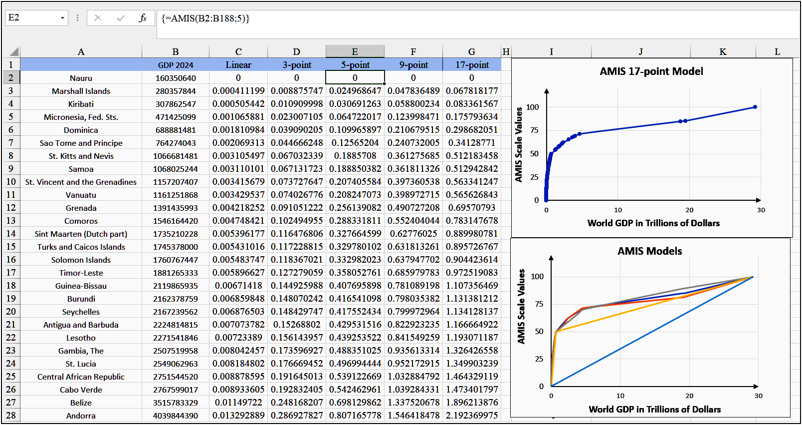

# AMIS Excel Plugin

An Excel add-in implementing the Adaptive Multi-Interval Scale (**AMIS**) normalization method.
It transforms heterogeneous numerical data (like GDP or test scores) into a unified 0–100 scale directly in your spreadsheet.

**Scientific Foundation:** This plugin implements the AMIS method described in: Kravtsov, G. (2025).
*Universal Adaptive Normalization Scale: Integration of Heterogeneous Metrics into a Unified System* (Version v1).
https://doi.org/10.5281/zenodo.17588054

## Quick Start

### System Requirements
*   **Microsoft Excel 2010** or later (tested on 32-bit Excel 2019).
*   **Windows** operating system.
*   **.NET Framework 4.7.2** (usually included in Windows 10/11).

### Installation (3 Steps)
1. Download the `AMIS_32bit-AddIn-packed.xll` file from the [Releases](https://github.com/Famimot/AMIS_Excel_Plugin/releases) page.
2. In Excel: **File → Options → Add-ins**.
3. At the bottom, select **"Excel Add-ins"** → **"Go..."** → **"Browse..."** → select the `.xll` file → **OK**.

The add-in is now loaded. Use `=AMIS()` in any workbook.

## How to Use

### Main Function: `AMIS`
Normalizes a range of numerical data to a 0–100 scale.

**Syntax:**
```excel
=AMIS(data_range; [model_number])
```

**Arguments:**

- **`data_range` (required):** The range containing numbers (e.g., `B2:B188`).
- **`model_number` (optional):** An integer specifying the model. Default is `5`.
  - `1` = Linear model
  - `3` = 3-point model
  - `5` = 5-point model (default)
  - `9` = 9-point model
  - `17` = 17-point model

**Important Note on Argument Separator:**
The formula uses a semicolon (`;`) as shown above, which is correct for most European and Russian regional settings. 
If you encounter an error, try using a comma (`,`) instead, which is standard for US/UK settings: `=AMIS(B2:B188, 9)`.

**Example** (enter as an array formula with Ctrl+Shift+Enter if required by your Excel version):

```
 =AMIS(B2:B188; 9)
```
### Helper Functions

**`=AMIS_AVAILABLE_MODELS(N)`** – Returns models available for N data points.

**`=AMIS_TEST()`** – Verifies the add-in is loaded correctly.


### Model Selection Guide

| Data Points (N) | Recommended Model | Available Models |
| :--- | :--- | :--- |
| N < 10 | Linear (1) | Linear only |
| 10 ≤ N < 20 | 3-point (3) | Linear, 3-point |
| 20 ≤ N < 50 | **5-point (5)** | Linear, 3-point, 5-point |
| 50 ≤ N < 100 | 9-point (9) | Linear, 3-point, 5-point, 9-point |
| N ≥ 100 | 17-point (17) | All models |

📈 Practical Example: Normalizing 2024 Country GDP Data
The add-in's effectiveness is demonstrated using nominal GDP data for 187 countries.


## 📈 Practical Example: Normalizing 2024 Country GDP Data
The add-in's effectiveness is demonstrated using nominal GDP data for 187 countries.

### Results (Sample)

| Country | Nominal GDP (USD), 2024 | AMIS Value (0–100) |
| :--- | :--- | :--- |
| Nauru | 160,350,640 | 0.00 |
| Kenya | 124,498,691,699 | 25.25 |
| Belgium | 664,564,181,487 | 49.62 |
| Russian Federation | 2,173,835,806,672 | 60.07 |
| United States | 29,184,890,000,000 | 100.00 |


## 📊 Screenshot Example


*Figure 1: Demonstration of the AMIS Excel plugin normalizing 2024 world GDP data. Shows original data, AMIS normalized results for all models (linear, 3, 5, 9, 17-point), and comparative statistics including z-scores.*


## Building from Source

To compile the plugin from source code:

```bash
git clone https://github.com/Famimot/AMIS_Excel_Plugin.git
cd AMIS_Excel_Plugin/src
dotnet restore
dotnet build --configuration Release
```

## Project Structure (For Developers)
```plaintext
AMIS_Excel_Plugin/
├── build/                          # Compiled add-in files
│   ├── AMIS_32bit-AddIn-packed.xll    # Main plugin (32-bit)
│   └── AMIS_32bit-AddIn64-packed.xll  # Experimental (64-bit)
├── src/                            # Source code
│   ├── AMIS_FINAL.cs              # Core algorithm
│   ├── AMIS_32bit-AddIn.dna       # Excel-DNA config
│   └── AMIS_32bit.csproj          # .NET project
├── examples/                       # Demo files
│   └── World_Bank_Nominal_GDP_All_Countries_2024.xlsx
├── images/                         # Screenshots
│   └── AMIS_Excel_Plugin_Demo.png
└── README.md                       # Documentation
```
## License
[MIT License](LICENSE)

## 📄 Citation

If you use the AMIS Excel Plugin in your research, please cite both the methodology paper and the software:

**Methodology Paper:**  
Kravtsov, G. (2025). *Universal Adaptive Normalization Scale (AMIS): Integration of Heterogeneous Metrics into a Unified System* (Version v1). https://doi.org/10.5281/zenodo.17588054

**Software:**  
Kravtsov, G. (2026). *AMIS Excel Plugin* (Version 1.0.0) [Computer software]. https://github.com/Famimot/AMIS_Excel_Plugin


